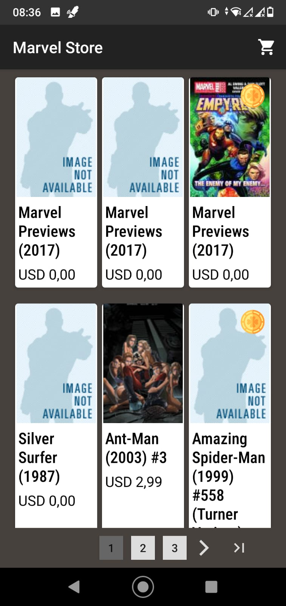
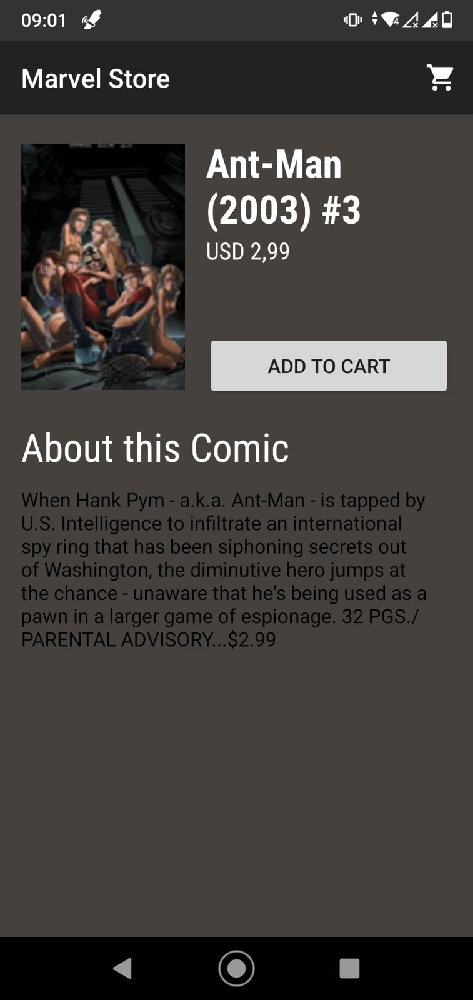
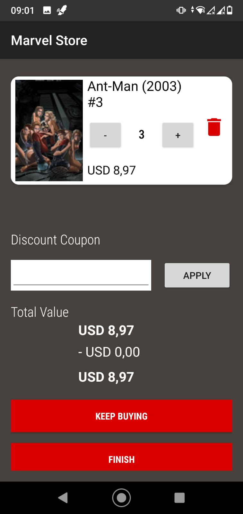

# MarvelStore
##### Version 0.0.1

Uma apliação que usa a API da Marvel.

## A API:
### 1. Pegue uma Chave Pública e uma Privada
Para fazer isso basta acessar o site https://developer.marvel.com, onde é possível criar sua conta e facilmente possuir o acesso a chave. No site também é possível ter acesso à documentação da API, bem como a um simulador capaz de simular todas as chamadas da API.

### 2. Utilizando as chaves no código
Para fazer as requisições com a API é necessário que se tenha as duas chaves (pública e privada) bem como é importante ter o timestamp no momento em que a requisição for realizada. Desta forma, para realizar uma requisição:
```
'https://gateway.marvel.com/v1/public/' + rota (no caso 'comics/') + '?ts=VALORDATIMESTAMP&apikey=PUBLICKEY&hash=HASH'
```
Observe que a hash que é incluída na rota para a realização das requisições é um hash MD5 do texto que inclui, respectivamente, timestamp + private key + public key. Sendo assim, com os três itens é possível realizar a requisição desejada. 
A arquitetura REST do Java permite realizar essa requisição sem maiores problemas.

## O APP:
Os quadrinhos foram dispostos em páginas. Sendo assim, o usuário pode navegar entre as páginas consultando todas as possibilidades. Cada página contém 48 quadrinhos dispostos em forma de grid, utilizando RefreshLayout. Nesse momento coube uma decisão entre dispor todos os quadrinhos em uma só tela ou dividir em páginas. Decidi que dividir em páginas seria mais interessante na ocasião, pelas seguintes razões:
* Uma tela mais limpa para o usuário, onde ele pode navegar apenas passando de uma página para outra, sem a necessidade de rolar muito a tela do celular.
* Poupar memória, uma vez que carregar todos os quadrinhos de uma vez iria demandar mais recursos do dispositivos (logo, a cada página que o usuário acessa é feita uma nova requisição à API)
Dado um pequeno resumo, cabe uma análise de cada tela.

### 1. SplashScreen

A tela, além de mostrar a logomarca da Marvel, inicia o carregamento dos quadrinhos.

### 2. Home

A home mostra os quadrinhos dispostos em páginas. Cada página possui 48 quadrinhos, um número escolhido por "tentativa e erro" para buscar achar o número mais confortável em relação à experiência do usuário. 
Com a possibilidade de avançar muitas páginas, há também a opção de que, caso seja do gosto do usuário, ir até a última página ou, se já estiver distante do início, voltar até a primeira página.

### 3. Descrição do Quadrinho

Ao selecionar um quadrinho, uma chamada para uma nova Activity é feita pelo aplicativo, enviando para a nova activity as informações do quadrinho selecionado.

### 4. Checkout

Ao selecionar o quadrinho para comprar, o usuário pode alterar as quantidades, apagar um produto da lista (se ele apagar todos os quadrinhos o aplicativo volta para a tela home para que o usuário escolha novos produtos) e até mesmo inserir cupons. Os cupons podem ser Raros (que dão 25% de desconto no valor da compra) ou Comuns (que dão 10% de desconto no valor total da compra). Para testar basta usar:

#### Cupons Raros
- CUPOMABCD
- CUPOMDEFG
- CUPOMDHIJ
#### Cupons Comuns
* CUPOMKLM
* CUPOMNOP
* CUPOMQRS

Note que, caso o usuário escolher voltar para a tela anterior para escolher mais quadrinhos e ter registrado um cupom, o cupom permanece salvo até que o usuário finalize a compra ou que ele mesmo apague/mude o cupom.
O desenvolvimento seguiu a arquitetura MVC.

## Tratamentos de Erro
O aplicativo avisa ao usuário quando houve algum problema com a conexão no momento da requição. Caso o usuário Informe um cupom de desconto inválido o aplicativo também transmite uma mensagem. Caso o usuário queira abrir o carrinho sem ter nenhum quadrinho, uma mensagem é exibida ao usuário informando que o carrinho está vazio.
